# DEPLOYING ELASTIC STACK ON AWS EC2 INSTANCE FOR OBSERVABILITY AND MONITORING

To start with , i would like to explain what **Observability in DevOps means**. Observability refers to the methodology and practice of obtaining real world insights into the behaviour, perfomance,  and health of complex software systems, and infrastucture components. It involves collecting, analyzing, and visualizing various data points, metrics, logs, traces, and events to understand how a system is functioning, identify issues, and make informed decisions to improve its performance and reliability.

The ELK Stack or Elastic Stack is a collection of; Elasticsearch, Logstash, Kibana and Beats.
The ELK Stack helps by providing users with a powerful platform that collects and processes data from multiple data sources, stores that data in one centralized data store that can scale as data grows, and that provides a set of tools to analyze the data.

- Elasticsearch; is a JSON  NoSQL database used to store inputs or logs. It listens on port:9200 by default
- Logstash; is a data processing pipeline that ingests, processes, and transforms data from multiple sources before sending it to various destinations. Logstash can process various types of data, including logs, metrics, and events. It can also perform parsing, filtering, and formatting of data before forwarding it to Elasticsearch. It listens on port:5044 by default
- Kibana; is a data visualization and exploration tool. It provides a frindly web based User Interface, used by Elasticsearch to interact with data. It listens on port:5601 by default
- Beats; are lightweight data shippers designed to collect, ship, and send various types of data to Elasticsearch or Logstash.

This components are designed in a way to interact and play nicely with each other without too much extra configuration.


## **INSTALLING AND IMPLEMENTING ELK**

For the purpose of this project, we will spin up four(4) EC2 instances. One instance to install elasticsearch, one instance for kibana kibana, one instance for nginx as reverse proxy for the Filebeat, and the last instance for apache as reverse proxy for the Filebeat.

Environment Specifications;
- Default VPC
- Default public subnets
- Create 4 Ubuntu Ec2 servers with instance type t2.xlarge
- Enable security group to allow traffic from anywhere.
- Create a key-pair

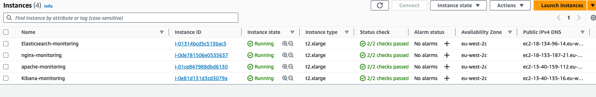

### **Implementing Elasticsearch**;

- ssh into the instance

- update repository on the server

`sudo apt update -y`

- install java run time environment

`sudo apt install default-jre -y`

- install java development kit

`sudo apt install default-jdk -y`

- import the Elastic Stack GPG (GNU Privacy Guard) public key into the system's keyring so that the downloaded package can be verified.

`curl -fsSL https://artifacts.elastic.co/GPG-KEY-elasticsearch |sudo gpg --dearmor -o /usr/share/keyrings/elastic.gpg`

- add the repository definition to the system

`echo "deb [signed-by=/usr/share/keyrings/elastic.gpg] https://artifacts.elastic.co/packages/7.x/apt stable main" | sudo tee -a /etc/apt/sources.list.d/elastic-7.x.list`

- update

`sudo apt update -y`

- install Elasticsearch

`sudo apt install elasticsearch -y`


- Now let's open the *elasticsearch.yml* configuration file in the /etc/elasticsearch directory to do some configuration on the node name, and network settings
**NB; by default Elastic search is only accessible on localhost. There is need to set a different address to expose the node on the network. Here i opened the node to allow access from anywhere (0.0.0.0).**

`sudo vi /etc/elasticsearch/elasticsearch.yml`

- Comment out and edit accordingly

```
network.host: 0.0.0.0 
discovery.seed_hosts ["<elasticsearch-private ip-address"]
cluster.initial_master_nodes ["elasticsearch-private ip-address"]
```

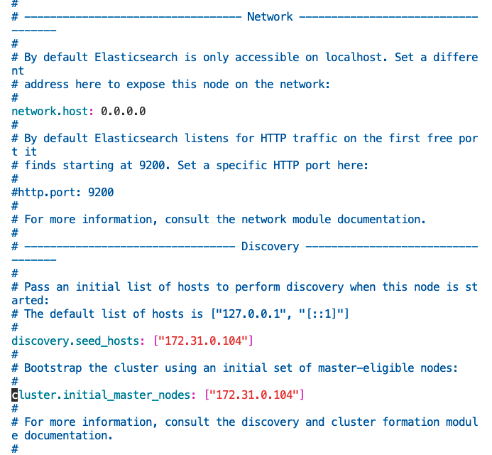

- One main advantage with elastic search as a database storage is that it is highly scalable i.e you can add more and more node to the server as the need increases.

- **discovery.seed_hosts** ;  is used to specify a list of initial hostnames or IP addresses of other nodes in the cluster that a new node should attempt to connect to when it starts up. These seed hosts are used for the discovery process, allowing new nodes to find existing nodes and join the cluster.

- **cluster.initial_master_nodes** ;  is used during the initial setup of a new cluster. It specifies a list of node names that are considered master-eligible during the first startup of the cluster. These nodes will participate in the election of the initial master node. This setting is particularly important to avoid split-brain scenarios where multiple nodes believe they are the master.

- Start and enable elastic search

`sudo systemctl start elasticsearch && sudo systemctl enable elasticsearch`


### **Implementing Kibana**
- ssh into Kibana instance

- update repository

`sudo apt update`

- Install `jre`, `jdk`, `import the Elastic Stack GPG`, and `add the repository definition to the system` as above.

- update repo

`sudo apt update -y`

- Install Kibana

`sudo apt install kibana -y`

- Enable and start Kibana

`sudo systemctl enable kibana && sudo systemctl start kibana`

`sudo systemctl status kibana`

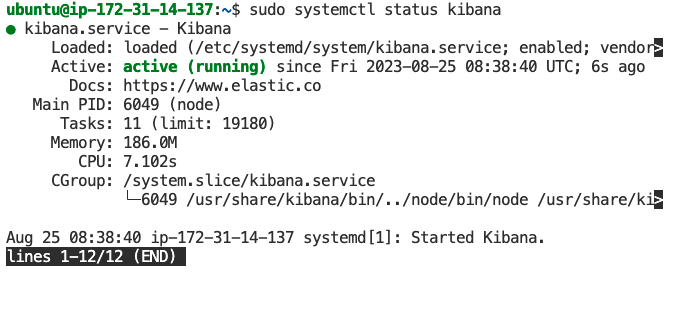

NB; by default, Kibana is configured to only listen on localhost, there is need to set up a reverse proxy to allow external access to it. Nginx is used for this purpose here.

- update repo

`sudo apt update`

- install nginx

`sudo apt install nginx -y`

- configure the proxy to point to to Kibana instance by opening up the `/etc/nginx/sites-available/`  and paste below conf, edit public ip to the `public ip` of the Kibana accordingly.
Comment out the auth session for now.

`sudo vim /etc/nginx/sites-available/kibana`

```
server {
    listen 80;

    server_name <kibana-public-ip>;

    #auth_basic "Restricted Access";
    #auth_basic_user_file /etc/nginx/htpasswd.users;

    location / {
        proxy_pass http://localhost:5601;
        proxy_http_version 1.1;
        proxy_set_header Upgrade $http_upgrade;
        proxy_set_header Connection 'upgrade';
        proxy_set_header Host $host;
        proxy_cache_bypass $http_upgrade;
    }
}
```

- Link the site-available to sites-enabled

`sudo ln -s /etc/nginx/sites-available/kibana /etc/nginx/sites-enabled/kibana`

- Confirm that the configuration is successful

`sudo nginx -t`

- Reload nginx

`sudo systemctl reload nginx`

To configure Kibana to talk to Elasticsearch, there is need to specify the Elasticsearch cluster's URL in Kibana's configuration file. Open the Kibana conf file and edit accordingly.

`sudo vim /etc/kibana/kibana.yml`

- Look for the line that specifies `elasticsearch.hosts` in the configuration file, set the value to the URL of your Elasticsearch cluster.

`elasticsearch.hosts: ["http://<elasticsearch-public-ip>:9200"]`

- Restart Kibana to apply changes

`sudo systemctl restart kibana`

- You must restart elasticasearch as well on the Elasticsearch instance to apply changes.

`sudo systemctl restart elasticsearch`

`curl localhost:5601`


### **Implementing Filebeat to export logs to Elasticsearch**

For the purpose of this project we'll configure our logs from Filebeat to go straight into Elasticsearch and not `Logstash`. `Logstash` mainly is used for processing and filtering data. For this project we just  want to send our logs directly to Elasticsearch for logging and monitoring as mentioned earlier.

Now it's time to start shipping logs to Elasticsearch.

Filbeat are lightweight and efficient data shippers, it is used to collect and ships log files and event data from various sources. It can monitor log files, detect changes, and send log data to Elastic search of Logstash for indexing and analysis.
Its primary role is to collect and forward log data from various sources to a central location, typically Elasticsearch or Logstash.
Let's begin---

- ssh into the instance

- update repo

`sudo apt update`

- install nginx

`sudo apt install nginx -y`

- Install `jre`, `jdk`, `import the Elastic Stack GPG`, and `add the repository definition to the system` as above.

- update repo

`sudo apt update -y`

- Install filebeat

`sudo apt install filebeat -y`

- Open the filebeat.yml conf

`sudo vi /etc/filebeat/filebeat.yml`

- Configure Elasticsearch Output `output.elasticsearch` and replace with the public-ip of the Elasticsearch instance.

```
output.elasticsearch:
  # Array of hosts to connect to.
  hosts: ["<elastricsearch-public-ip>:9200"]
```

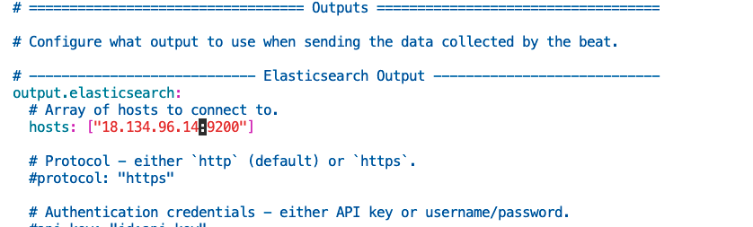

- Restart and enable filebeat

`sudo systemctl start filebeat && sudo systemctl enable filebeat`

Filebeat has extended functionality. This modules makes filebeat aware of different default files on the servers. In this documentation, we will use `system module`, which collects and parses logs created by the system logging service of common Linux distributions.

- By default this module are disabled, now let's enable the system and nginx modules

`ls -latr /etc/filebeat/modules.d/`

- Let's open up the the system module to see what we've got in there,

`cat /etc/filebeat/modules.d/system.disabled.yml`

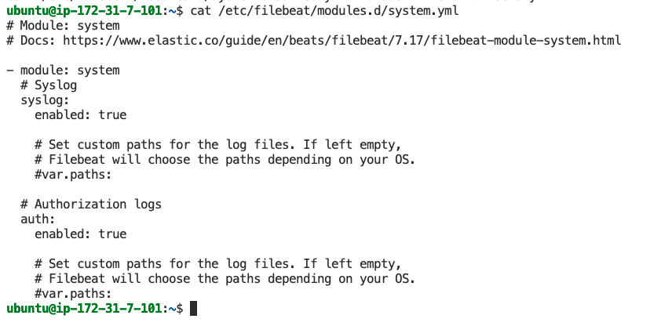

- So,by enabling this module, it goes into the server Syslog (/var/log/syslog), gets syslog and auth log data, then ship/forward the data to Elasticsearch.

`sudo filebeat modules enable nginx` **OR** `sudo mv /etc/filebeat/modules.d/nginx.yml.disabled /etc/filebeat/modules.d/nginx.yml`

`sudo filebeat modules enable system` **OR** `sudo mv /etc/filebeat/modules.d/system.yml.disabled /etc/filebeat/modules.d/system.yml`

`sudo filebeat modules list`


- Restart filebeat

`systemctl restart filebeat`

- By default, Filebeat is configured to use default paths for the syslog and authorization logs. 

Now let's write a bash shell script to perform *load testing* on the filebeat server using the `ab` (Apache Benchmark) tool.
What this script will do is; it will repeatedly run multiple load testing scenarios in an infinite loop and sleeps for a short interval between each iteration.

- create a file and paste below bash script in it.

`sudo vi loadtest.sh`

```
#!/bin/bash

while true; do
	echo "Running ab -n 1000 -c 100 http://localhost/"
	ab -n 10000 -c 10000 http://localhost/

	echo "Running ab -n 100 -c 100 -l http://localhost/"
	ab -n 1000 -c 10000 -l http://localhost/

	echo "Running ab -n 1000 -c 5 http://localhost/"
	ab -n 10000 -c 50 http://localhost/

	echo "Running ab -n 1000 -c 100 http://localhost/nonexistent-resource"
	ab -n 10000 -c 10000 http://localhost/nonexistent-resource

	sleep 5  # Adjust the sleep interval as needed
done
```
- Change permission

`sudo chmod +x loadtest.sh`

Before running the script, we need to install the `ab` tool on our ubuntu system

```
sudo apt update 
sudo apt install apache2-utils -y
```

- Now let's go ahead to run the script

`./loadtest.sh`

Note that Elastic search has started receiving data, but Kibana requires an *index pattern* to identify which data streams, indices, and index aliases we want to explore. The pattern we want to create here is the `filebeat-*`

- Paste the public-ip of Kibana in the browser

- Navigate to the Discover tab and open

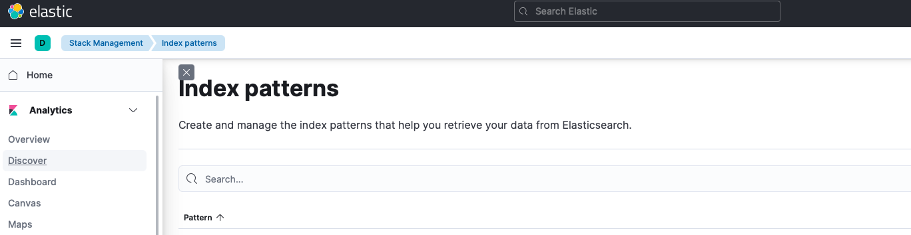

- Click `Create index pattern` and edit accordingly, make sure to select the timestamp field

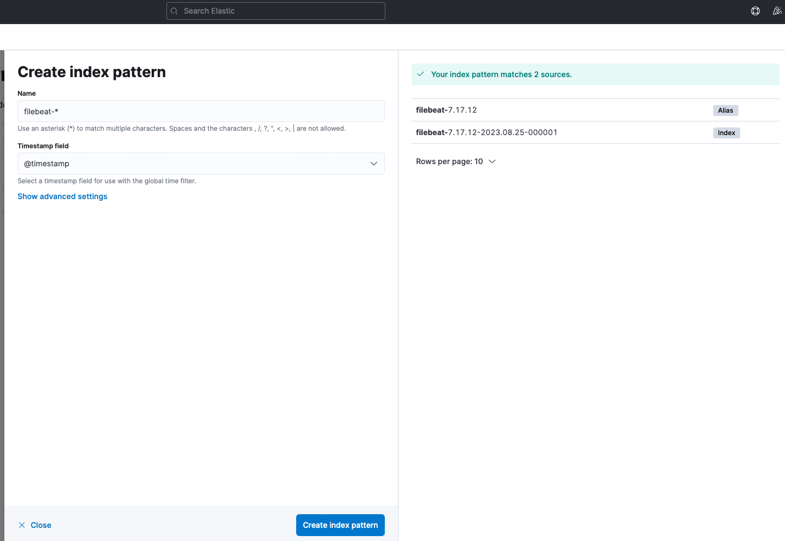

- Navigate to Discover to see data flowing through

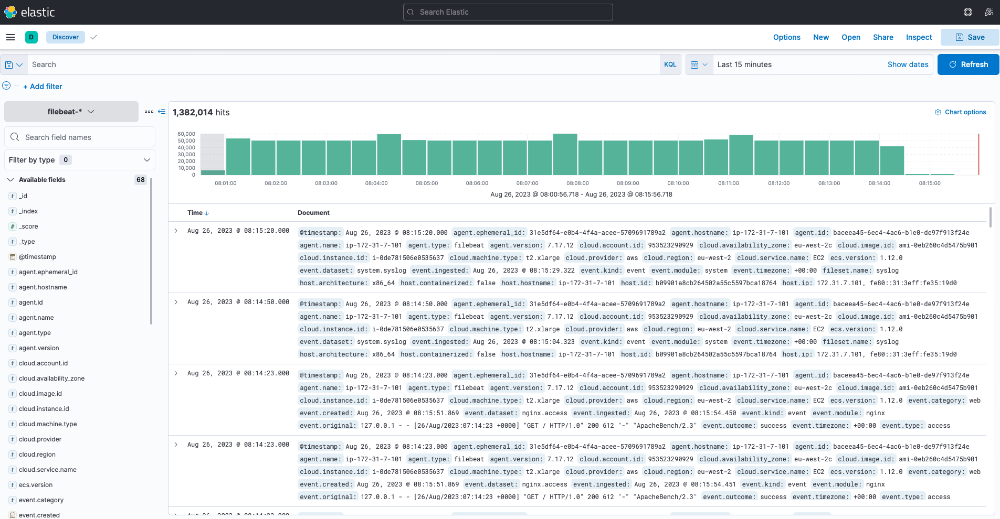

**Let's explore**

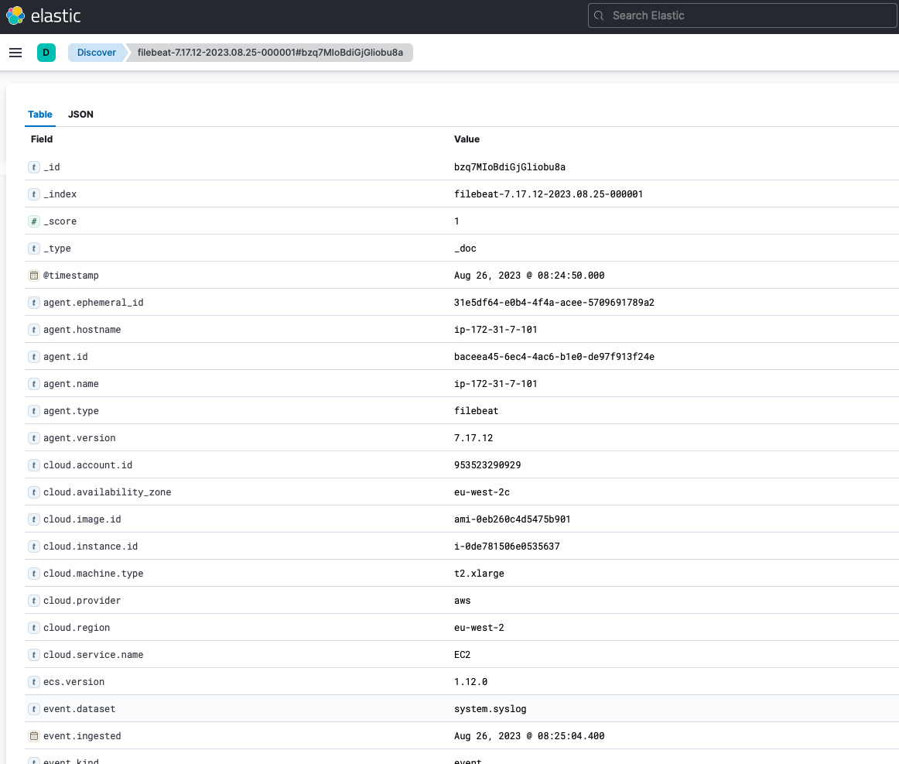

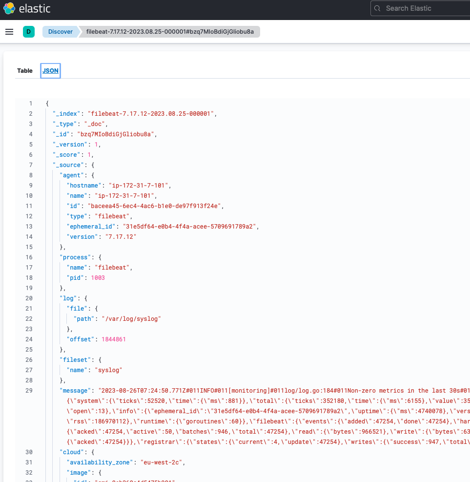

Now we can see where data is coming from, details about the instance and so on.

Next, we need to create dasboards in Kibana to provide visual representation of data for easy and quick monitoring, analysis and to gain insights from the data effectively.
For this, filebeat has  a functionality that helps create dashboard. This will be performed on the Kibana host.

- First we need to install filebeat on the Kibana server.

`sudo apt install filebeat -y`

- Then run below command to load dashboards in Kibana.

`sudo filebeat setup -E output.logstash.enabled=false -E output.elasticsearch.hosts=['<elasticsearch-public-ip>:9200'] -E setup.kibana.host=localhost:5601`

Quick overview of what the above code will do;

- `sudo filebeat setup`: is the Filebeat command used to set up the initial configuration and templates required for Filebeat to interact with Elasticsearch and Kibana.

- `-E output.logstash.enabled=false`: This option specifies that Filebeat should not send data to Logstash. By default, Filebeat sends data to Elasticsearch directly. Setting this option to false ensures that the Logstash output is disabled.

- `-E output.elasticsearch.hosts=['<elasticsearch-public-ip>:9200']`: This option sets the Elasticsearch host to which Filebeat should send its data. 

- `-E setup.kibana.host=localhost:5601`: This option sets the Kibana host that Filebeat should use for setting up dashboards and visualizations in Kibana. The value localhost:5601 indicates that Kibana is running on the same machine and accessible at that address.

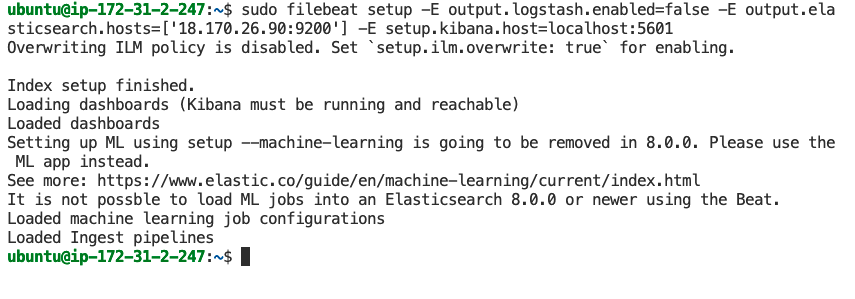

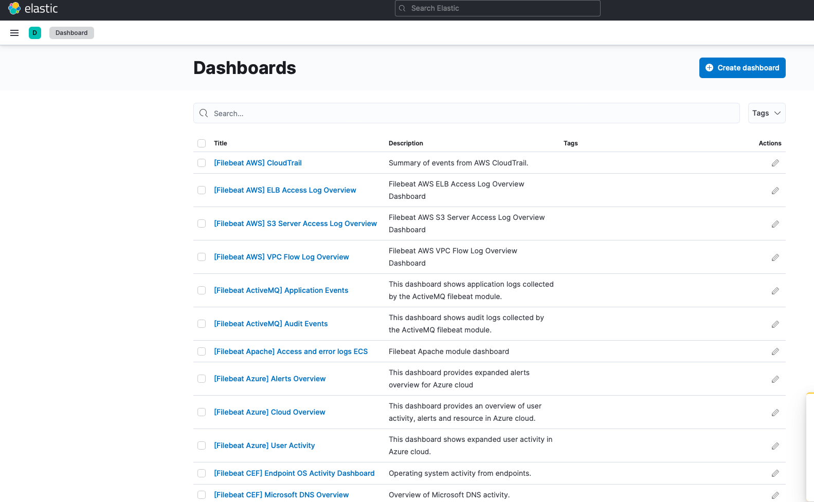


We can then go further to filter. Let's filter by nginx data comng through.


There are lot more options to explore.


